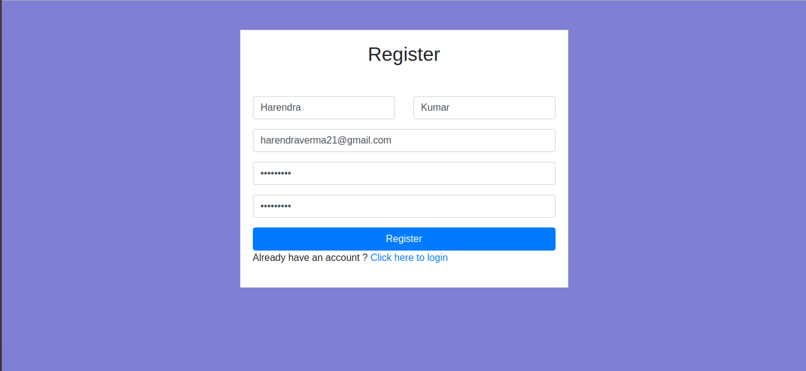
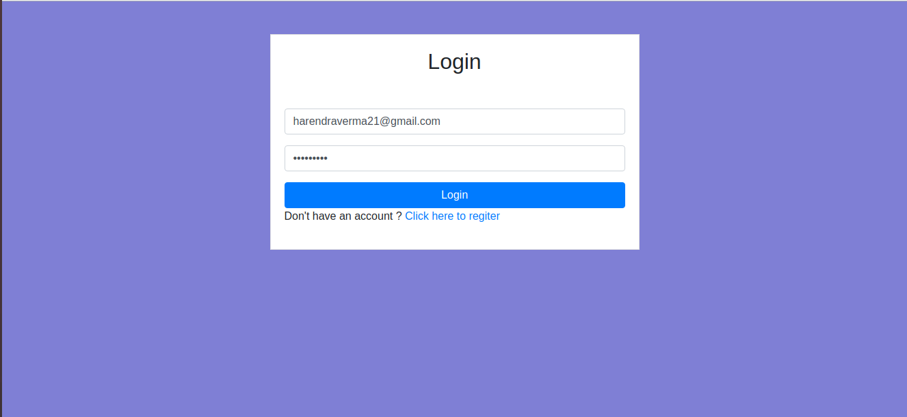
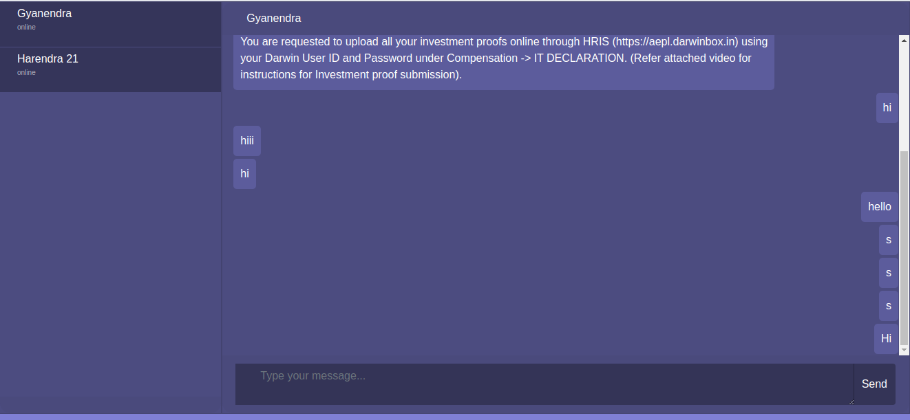

# features 
1. Login
2. Register
3. Private Chat
4. Real time
5. Store chats in database
6. Responsive Ui
 
This project is build with php websockets and angular js for realtime chat with feature given above section.

# Introduction to WebSockets
WebSockets is a bi-directional, full-duplex, persistent connection from a web browser to a server. Once a WebSocket connection is established the connection stays open until the client or server decides to close this connection. With this open connection, the client or server can send a message at any given time to the other. This makes web programming entirely event driven, not (just) user initiated. It is stateful. As well, at this time, a single running server application is aware of all connections, allowing you to communicate with any number of open connections at any given time.

# Installation
1. Clone the repository from Github using — `git clone https://github.com/harendra21/Realtime-One-To-One-Chat.git`
2. Place the cloned folder to your local server.
3. Now open cmd in this in the cloned directory and run — “composer install”
4. Import Database and change the configuration in `config.php` file according to your database.
5. Change `base_url` in `public/script/app.js` according to your project location.
6. Then change directory to bin folder by — “cd bin”
7. Stat-server by — “php chat-server.php”
8. Now hit public folder of the project by your browser — “localhost/path_to_your_folder/public”
9. Enjoy!

# Database table

```sql
CREATE TABLE `messages` (
  `id` int(11) NOT NULL AUTO_INCREMENT,
  `from_id` int(11) NOT NULL,
  `to_id` int(11) NOT NULL,
  `type` varchar(255) NOT NULL,
  `value` text NOT NULL,
  `created_at` timestamp NOT NULL DEFAULT CURRENT_TIMESTAMP,
  `updated_at` timestamp NOT NULL DEFAULT CURRENT_TIMESTAMP ON UPDATE CURRENT_TIMESTAMP,
  PRIMARY KEY (`id`)
) ENGINE=InnoDB AUTO_INCREMENT=68 DEFAULT CHARSET=latin1;

CREATE TABLE `socket_id` (
  `id` int(11) NOT NULL AUTO_INCREMENT,
  `user_id` int(11) DEFAULT NULL,
  `socket_id` int(11) DEFAULT NULL,
  PRIMARY KEY (`id`)
) ENGINE=InnoDB AUTO_INCREMENT=121 DEFAULT CHARSET=latin1;

CREATE TABLE `users` (
  `id` int(11) NOT NULL AUTO_INCREMENT,
  `firstname` varchar(255) NOT NULL,
  `lastname` varchar(255) NOT NULL,
  `email` varchar(255) NOT NULL,
  `password` varchar(255) NOT NULL,
  `profile_image` varchar(255) DEFAULT NULL,
  `created_at` timestamp NOT NULL DEFAULT CURRENT_TIMESTAMP,
  `updated_at` timestamp NOT NULL DEFAULT CURRENT_TIMESTAMP ON UPDATE CURRENT_TIMESTAMP,
  PRIMARY KEY (`id`)
) ENGINE=InnoDB AUTO_INCREMENT=8 DEFAULT CHARSET=latin1;
```

## Register
[http://localhost/chat/public/#!/register](http://localhost/chat/public/#!/register "Register Page")



## Login
[http://localhost/chat/public/#!/login](http://localhost/chat/public/#!/login "Login Page")



## Chat
[http://localhost/chat/public/#!/](http://localhost/chat/public/#!/ "Chat Page")



